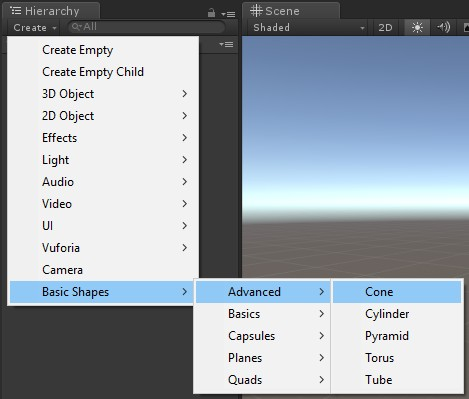

# Muffin Dev for Unity - Basic Shapes

Bundle of basic shapes models, and ready-to-use prefabs.

All meshes of this module have a pivot set at (0;0;0) coordinates, making the level design easier.

## Editor tools

This module adds useful controls in *GameObject > Create* menu, that allows you to instantiate prefabs of this module directly from the *Hierarchy* view:

## Summary

- [`BasicShapesIndex`](./basic-shapes-index.md)