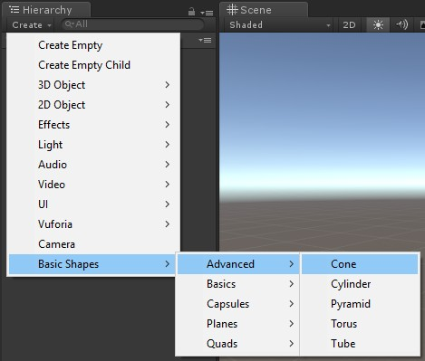

# Muffin Dev for Unity - Basic Shapes - `BasicShapesIndex` class

References all basic shape prefabs, and add editor menus to instantiate them.

This class adds additional menu to the editor, **so it is meant to be used only in the editor**:

## Create a new `BasicShapesIndex` asset

An asset of this type already exists in this module's folder (in *Basic Shapes/Editor/Resources*).

If the asset is missing, you can create a new asset of this type, click on *Assets > Create > Muffin Dev > Editor > Basic Shapes Index*.

You must reference all prefabs of Basic Shapes module inside this asset, sorted by groups. Note that group names are same as folder names ("Advanced", "Capsules", ...).